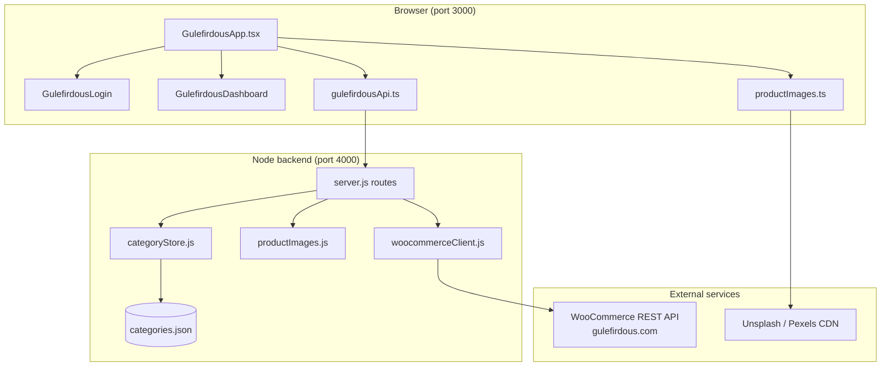

# Gulefirdous MVP — Cursor Agent Guide

Use this document when starting a **new Cursor Cloud Agent** session to continue development on the Gulefirdous project. Paste or reference it in your agent prompt so the agent has full context without re-discovering the codebase.

**Repository:** https://github.com/suhaibzubair/Gulefirdous  
**Live site (WordPress):** https://gulefirdous.com  
**Origin:** Migrated from SolsGate branch `cursor/gulefirdous-mvp-caad`

---

## 1. What this project is

Gulefirdous is a **fragrance e-commerce MVP** for a Pakistani perfume brand. It includes:

- A **React web app** that mirrors the planned mobile app UX (admin + client roles)
- A **Node.js backend** that securely proxies WooCommerce REST API calls
- **In-memory demo data** for products, orders, social ads, and analytics (not yet fully wired to WooCommerce from the UI)
- **Category-based product image pools** using curated Unsplash/Pexels stock photos (simulated “AI generated” images)

### Business features implemented

| Area | Status | Notes |
|------|--------|-------|
| Admin login (email/phone + role) | ✅ Mock auth | No real backend auth yet |
| Admin sidebar navigation | ✅ | 8 admin pages |
| Client sidebar navigation | ✅ | 4 client pages |
| Admin dashboard (KPIs + charts) | ✅ | Chart.js; demo data |
| Product catalog by category | ✅ | In-memory products |
| Manage products (CRUD draft) | ✅ | Add, edit, duplicate check |
| Dynamic categories | ✅ | Backend JSON + optional WooCommerce sync |
| Category-wise image generation | ✅ | 5 photo pools, append-on-generate |
| Gallery image upload | ✅ | Local blob/data URL |
| Image preview modal | ✅ | Full-screen overlay |
| Social ads (Facebook/Instagram) | ✅ | Editable captions, mock publish |
| Orders & COD | ✅ | In-memory orders |
| TCS delivery tracking | ✅ | Status timeline mock |
| WooCommerce product sync (UI) | ⚠️ Partial | API exists; UI uses local state |
| Real authentication | ❌ | Not implemented |
| Persistent product storage | ❌ | Resets on refresh |

---

## 2. Repository structure

```
Gulefirdous/
├── README.md                    # Quick start
├── docs/
│   └── CURSOR_AGENT_GUIDE.md    # ← This file (agent onboarding)
├── docker-compose.yml           # Backend :4000, frontend :8080
├── frontend/                    # React 18 + TypeScript (Create React App)
│   ├── src/
│   │   ├── App.tsx              # Entry: renders GulefirdousApp only
│   │   ├── features/gulefirdous/
│   │   │   ├── GulefirdousApp.tsx      # Main app (~1700 lines, all pages)
│   │   │   ├── GulefirdousApp.scss     # All Gulefirdous styles
│   │   │   ├── GulefirdousLogin.tsx    # Login screen
│   │   │   ├── GulefirdousDashboard.tsx  # Admin charts/KPIs
│   │   │   ├── gulefirdousNav.ts       # Sidebar routes + types
│   │   │   ├── gulefirdousApi.ts       # Backend API client
│   │   │   └── productImages.ts        # Image pools + generation logic
│   │   └── test/_tests_/App.test.tsx   # 14 integration tests
│   ├── build/                   # Production build (served on :3000 in dev preview)
│   └── package.json
└── backend/                     # Node 18+ HTTP server (no Express)
    ├── server.js                # Entry point, loads .env
    ├── src/
    │   ├── server.js            # Route handlers
    │   ├── categoryStore.js     # JSON file category persistence
    │   ├── productImages.js     # Mirror of frontend image logic
    │   └── woocommerceClient.js # WooCommerce REST client
    ├── data/categories.json     # Default categories on disk
    ├── test/server.test.js      # 14 API tests
    └── .env.example
```

### Important: what is NOT used for Gulefirdous

The `frontend/` folder contains legacy SolsGate code (Redux, i18n, organizations, etc.). **The Gulefirdous MVP only uses:**

- `frontend/src/App.tsx` → `GulefirdousApp`
- Everything under `frontend/src/features/gulefirdous/`
- `frontend/src/test/_tests_/App.test.tsx`

Do not refactor unrelated legacy code unless explicitly asked.

---

## 3. Architecture



### Data flow patterns

1. **Products / orders / social posts** — stored in React `useState` inside `GulefirdousApp.tsx`. Refreshing the page resets them.
2. **Categories** — persisted in `backend/data/categories.json` via `GET/POST /api/categories`. Frontend fetches on admin login.
3. **Image generation** — runs **client-side** via `createNextImageBatch()` in `productImages.ts`. Backend endpoint `/api/product-images/generate` mirrors the same logic but the UI currently uses the local function directly.
4. **WooCommerce** — backend can list/create products and orders when credentials are configured. The MVP UI does not yet call these endpoints for product CRUD.

---

## 4. Local development setup

### Prerequisites

- Node.js 18+
- npm
- Python 3 (optional, for static preview server)

### Environment files

**Backend** — copy and fill `backend/.env`:

```bash
cd backend
cp .env.example .env
```

```env
PORT=4000
FRONTEND_ORIGIN=http://localhost:3000
WOOCOMMERCE_SITE_URL=https://gulefirdous.com
WOOCOMMERCE_CONSUMER_KEY=ck_...
WOOCOMMERCE_CONSUMER_SECRET=cs_...
WOOCOMMERCE_WEBHOOK_SECRET=...
ALLOW_LOCAL_CATEGORY_FALLBACK=true   # optional: skip WooCommerce on category create errors
```

**Frontend** — optional `frontend/.env`:

```env
REACT_APP_GULEFIRDOUS_API_BASE_URL=http://localhost:4000
```

### Install dependencies

```bash
cd frontend && npm install
cd ../backend && npm install   # backend has no npm deps, but run from folder
```

### Run tests (always do this before committing)

```bash
cd frontend && npm test -- --watchAll=false   # 14 tests
cd backend && npm test                         # 14 tests
```

### Run backend

```bash
cd backend
npm start
# → Gulefirdous backend listening on port 4000
```

### Run frontend (development with hot reload)

```bash
cd frontend
npm start
# → http://localhost:3000
```

### Run frontend (production preview — what users often use)

```bash
cd frontend
npm run build
cd build
python3 -m http.server 3000
# → http://localhost:3000 (static build, no hot reload)
```

> **Known issue:** The static preview server (`python3 -m http.server 3000`) can stop unexpectedly. Restart it from `frontend/build` if the site won't load.

### Docker

```bash
docker compose up --build
# Frontend: http://localhost:8080
# Backend:  http://localhost:4000
```

---

## 5. Frontend deep dive

### Entry point

`frontend/src/App.tsx` renders only `<GulefirdousApp />`.

### Main component: `GulefirdousApp.tsx`

Single large component (~1700 lines) containing:

- All state (`useState`, `useRef`, `useMemo`, `useEffect`)
- All page rendering via `renderPageContent()` switch on `activePage`
- Product form, image tools, order placement, social publishing

#### Key types (defined in-file)

```typescript
interface Product {
  id: number;
  name: string;
  category: string;
  price: number;
  stock: number;
  volumeMl: number;
  audience: "Men" | "Women" | "Unisex";
  notes: string[];           // from FRAGRANCE_NOTE_OPTIONS
  description: string;
  link: string;              // gulefirdous.com product URL
  sourceCode: string;
  imageUrl: string;
  imageSource: "AI generated" | "Gallery upload";
  imageLabel: string;
}

interface Order {
  id: string;                // e.g. "GF-1007"
  customer: string;
  productId: number;
  total: number;
  paymentMethod: "Cash on Delivery";
  source: string;            // Instagram, Facebook, Website, App
  status: OrderStatus;
  trackingNumber?: string;
}
```

#### Initial demo data

- **3 products:** Royal Oud, Bloom Mist, Heritage Attar Gift Set
- **2 orders:** GF-1007, GF-1008
- **2 engagement items:** mock social comments

### Navigation: `gulefirdousNav.ts`

| Role | Pages |
|------|-------|
| **admin** | dashboard, product-catalog, manage-categories, manage-products, social-ads, orders-delivery, payments, account-settings |
| **client** | shop, my-orders, track-delivery, account-settings |

Login is mock: any email/phone + role selection → instant session. No password, no JWT.

### API client: `gulefirdousApi.ts`

Base URL: `REACT_APP_GULEFIRDOUS_API_BASE_URL` or `http://localhost:4000`

Functions used today:
- `fetchCategories()` — admin login
- `createCategory(name, description)` — manage-categories page
- `generateProductImages()` — defined but UI uses local `createNextImageBatch` instead

Functions available but not wired in UI:
- `fetchWooProducts`, `createWooProduct`
- `fetchWooOrders`, `updateWooOrderStatus`

### Image system: `productImages.ts`

**Must stay in sync with** `backend/src/productImages.js`.

#### Category photo pools

| Category key | Pool constant | Images |
|--------------|---------------|--------|
| `perfume` | `PERFUME_PHOTOS` | 10 |
| `gift-set` | `GIFT_SET_PHOTOS` | 8 |
| `attar` | `ATTAR_PHOTOS` | 8 |
| `body-mist` | `BODY_MIST_PHOTOS` | 8 |
| `candles` | `CANDLE_PHOTOS` | 8 |

`resolvePhotoPoolForCategory()` also fuzzy-matches: `gift`, `attar`/`oud`, `mist`/`spray`, `candle`.

#### Generation algorithm

- `BATCH_SIZE = 4` images per generate click
- `createNextImageBatch()` rotates through pool using hash of category + product name + generation count
- Tracks `seenPhotoKeys` to avoid duplicates
- When pool exhausted, creates **crop variants** via `applyCropVariant()` (different w/h query params)
- Appends `?gen=<token>` to URLs for cache busting

#### Image error handling

```typescript
export const PRODUCT_IMAGE_FALLBACK = "https://images.unsplash.com/photo-1541643600914-78b084683601?...";
export function handleProductImageError(event) { /* swaps to fallback */ }
```

All `` tags in `GulefirdousApp.tsx` use `onError={handleProductImageError}`.

> **Maintenance rule:** External stock URLs can expire (404). When images break, `curl -L` test each URL and replace in **both** `productImages.ts` and `productImages.js`.

### Dashboard: `GulefirdousDashboard.tsx`

Chart.js charts with **hardcoded demo baselines**:
- Yearly sales line chart (`BASE_MONTHLY_SALES`)
- Sales by category bar chart (derived from in-memory products/orders)
- Social audience doughnut (`SOCIAL_AUDIENCE_BASE`)

### Styling: `GulefirdousApp.scss`

CSS variables on `.gf-app`:

| Token | Value | Usage |
|-------|-------|-------|
| `--gf-dark` | `#120f14` | Text, sidebar |
| `--gf-gold` | `#d4a574` | Accents, active borders |
| `--gf-green` | `#1a3d34` | Primary buttons |
| `--gf-cream` | `#f7f2eb` | Page background |
| `--gf-sale` | `#c73e54` | Sale highlights |

Fonts: **Montserrat** (UI), **Cormorant Garamond** (headings).

Image frame heights:
- Option grid: `140px`
- Selected: `168×140px`
- Thumb: `104px`
- Shop card: `168px`
- Preview modal: up to `720×620px`

All images use `object-fit: contain`.

---

## 6. Backend deep dive

### Server: plain Node `http` (no Express)

`backend/server.js` → `createServer()` from `src/server.js`.

### API reference

| Method | Path | Description |
|--------|------|-------------|
| `GET` | `/health` | `{ ok: true, service: "gulefirdous-backend" }` |
| `GET` | `/api/categories` | List categories from JSON store |
| `POST` | `/api/categories` | Create category `{ name, description }` |
| `GET` | `/api/products` | Proxy WooCommerce products |
| `POST` | `/api/products` | Create WooCommerce product |
| `POST` | `/api/product-images/generate` | Generate image batch |
| `GET` | `/api/orders` | Proxy WooCommerce orders |
| `PATCH` | `/api/orders/:id/status` | Update order status |
| `POST` | `/api/webhooks/woocommerce/order` | WooCommerce order webhook (HMAC verified) |

CORS allows `FRONTEND_ORIGIN` (default `http://localhost:3000`).

### Category store: `categoryStore.js`

- File: `backend/data/categories.json`
- Default categories: Perfume, Gift Set, Attar, Body Mist
- `createCategory()` assigns `id: Date.now()`, slugifies name
- Duplicate names return HTTP 409
- On `POST /api/categories`, optionally syncs to WooCommerce `createCategory()` if credentials exist

### WooCommerce client: `woocommerceClient.js`

- Basic auth with consumer key/secret
- Base: `{WOOCOMMERCE_SITE_URL}/wp-json/wc/v3`
- Methods: `listProducts`, `createProduct`, `listCategories`, `createCategory`, `listOrders`, `updateOrderStatus`
- Webhook signature verification via `verifyWooCommerceSignature()`

### WordPress status (as of migration)

- WooCommerce installed and active on gulefirdous.com
- Cash on Delivery enabled
- Store country/currency may still be US/USD — confirm before changing

---

## 7. Testing guide

### Frontend tests (`frontend/src/test/_tests_/App.test.tsx`)

14 tests covering:

| Test | What it verifies |
|------|------------------|
| Category-specific photos | Changing category reloads image pool labels |
| Category management UI | Categories page + product category dropdown |
| Dashboard render | KPIs, charts, social ad buttons |
| Social ad editing | Caption textarea editable |
| Facebook/Instagram publish | Mock publish updates status |
| COD order from shop | Client can place order |
| AI generated product + image | Full admin product flow |
| Gallery upload | File input selection |
| Gallery product draft | Product saved with gallery source |
| Duplicate perfume logic | Same name allowed if volume/audience/notes differ |
| Duplicate warning | Blocks exact duplicate |
| Image generation past 8 | Append keeps adding unique images |
| Image preview modal | Open/close preview |
| Edit product | Edit flow updates customer view |

#### Test helpers

```typescript
signInAsAdmin(loginId?)       // click Admin role + Sign in
signInAsClient(loginId?)      // wait for aria-pressed on Client, then sign in
goToSidebarPage(label)        // click nav button inside aria-label="App navigation"
```

> **Race condition fix:** Client sign-in test waits for `aria-pressed="true"` on Client button before submitting.

### Backend tests (`backend/test/server.test.js`)

Uses Node built-in `node:test` with mock WooCommerce client and temp category files.

---

## 8. Git workflow (Cursor Cloud Agents)

### Branch naming

```
cursor/<descriptive-name>-d9fc
```

Always lowercase. Suffix `-d9fc` is required for this project's agent sessions.

### Typical workflow

```bash
git checkout main
git pull origin main
git checkout -b cursor/my-feature-d9fc
# ... make changes, test, commit ...
git push -u origin cursor/my-feature-d9fc
# Open PR to main (draft by default)
```

### Recent feature branches / PRs

| Branch | Feature |
|--------|---------|
| `cursor/migrate-solsgate-gulefirdous-d9fc` | Initial MVP migration |
| `cursor/sidebar-login-theme-d9fc` | Login + sidebar + theme |
| `cursor/admin-dashboard-charts-d9fc` | Dashboard charts |
| `cursor/category-management-d9fc` | Dynamic categories |
| `cursor/category-image-generation-d9fc` | Category-wise images |
| `cursor/fix-broken-product-images-d9fc` | Fix 404 image URLs + fallbacks |

---

## 9. Known issues and pitfalls

| Issue | Detail | Fix |
|-------|--------|-----|
| Static server stops | `python3 -m http.server 3000` dies sometimes | Restart from `frontend/build` |
| Images 404 | External Unsplash/Pexels URLs expire | `curl` test + replace in both image files |
| No hot reload in preview | Production build served statically | Use `npm start` for dev, `npm run build` for preview |
| Products not persisted | All product state is in-memory | Wire to WooCommerce or add local storage |
| Categories need backend | Category API fails → frontend uses `FALLBACK_CATEGORIES` | Ensure backend running on :4000 |
| Duplicate image logic | `seenPhotoKeysRef` uses `basePhotoKey(url)` | Changing URLs resets seen state |
| Gallery images are blob URLs | Lost on page refresh | Need upload endpoint for production |
| WooCommerce currency | May be USD not PKR | Confirm with site owner before changing |

---

## 10. Suggested next development tasks

Prioritized backlog for continuing development:

### High priority

1. **Persist products to WooCommerce** — wire `saveProduct()` in `GulefirdousApp.tsx` to `createWooProduct()` / update endpoint
2. **Load products from backend on startup** — replace `initialProducts` with `fetchWooProducts()`
3. **Real image upload** — backend endpoint to store gallery images (S3 or WordPress media)
4. **Authentication** — replace mock login with real auth (JWT, Firebase, or WordPress users)

### Medium priority

5. **Order sync** — create WooCommerce orders when client places COD order
6. **Category image pool for new categories** — auto-assign or let admin pick a pool when creating category
7. **Split `GulefirdousApp.tsx`** — extract page components (manage-products, social-ads, shop) into separate files
8. **Persistent preview server** — systemd, pm2, or npm script that auto-restarts

### Lower priority

9. **Real Facebook/Instagram API** integration
10. **TCS tracking API** integration
11. **i18n / Urdu** support
12. **Mobile responsive** polish
13. **PWA** packaging for app-store-like install

---

## 11. Cursor agent instructions

Copy this block into a new Cursor agent session:

---

**Project:** Gulefirdous MVP (fragrance e-commerce, React + Node + WooCommerce proxy)

**Read first:** `docs/CURSOR_AGENT_GUIDE.md`

**Key rules:**
1. Gulefirdous code lives in `frontend/src/features/gulefirdous/` — do not refactor unrelated legacy SolsGate code
2. Keep `productImages.ts` and `backend/src/productImages.js` in sync
3. Run `npm test` in both `frontend/` and `backend/` before committing
4. Branch names: `cursor/<name>-d9fc`, PR base: `main`
5. Never put WooCommerce secrets in frontend env
6. After `npm run build`, restart static server on port 3000 if testing preview
7. Test image URLs with `curl -L` before adding to photo pools
8. Minimize diff scope — match existing patterns in `GulefirdousApp.tsx` and SCSS

**Ports:**
- Frontend: `http://localhost:3000`
- Backend: `http://localhost:4000`

**Sign in for testing:**
- Admin: any email + click "Administrator" + Sign in
- Client: any email + click "Client" + Sign in

---

## 12. Quick command reference

```bash
# Full verify before PR
cd frontend && npm test -- --watchAll=false && npm run build
cd backend && npm test

# Start both services
cd backend && npm start &
cd frontend/build && python3 -m http.server 3000 &

# Test all image URLs
grep -oP 'https://[^"]+' frontend/src/features/gulefirdous/productImages.ts | sort -u | while read url; do
  code=$(curl -s -o /dev/null -w "%{http_code}" -L --max-time 10 "$url")
  [ "$code" != "200" ] && echo "FAIL $code $url"
done

# Health check
curl http://localhost:4000/health
curl http://localhost:3000/
```

---

## 13. File change cheat sheet

| If you need to… | Edit these files |
|-----------------|------------------|
| Add a new admin/client page | `gulefirdousNav.ts`, `GulefirdousApp.tsx` (renderPageContent), `GulefirdousApp.scss` |
| Change product form fields | `GulefirdousApp.tsx` (Product interface, form, saveProduct) |
| Add API endpoint | `backend/src/server.js`, `gulefirdousApi.ts`, `backend/test/server.test.js` |
| Add product category | `categoryStore.js` DEFAULT_CATEGORIES, `categories.json`, `productImages.ts` pool map |
| Add images for a category | `productImages.ts` + `productImages.js` (new pool or extend existing) |
| Change theme/colors | `GulefirdousApp.scss` CSS variables |
| Change dashboard charts | `GulefirdousDashboard.tsx` |
| Add tests | `frontend/src/test/_tests_/App.test.tsx` |

---

*Last updated: June 2026 — reflects state through PR #6 (broken image URL fix).*
